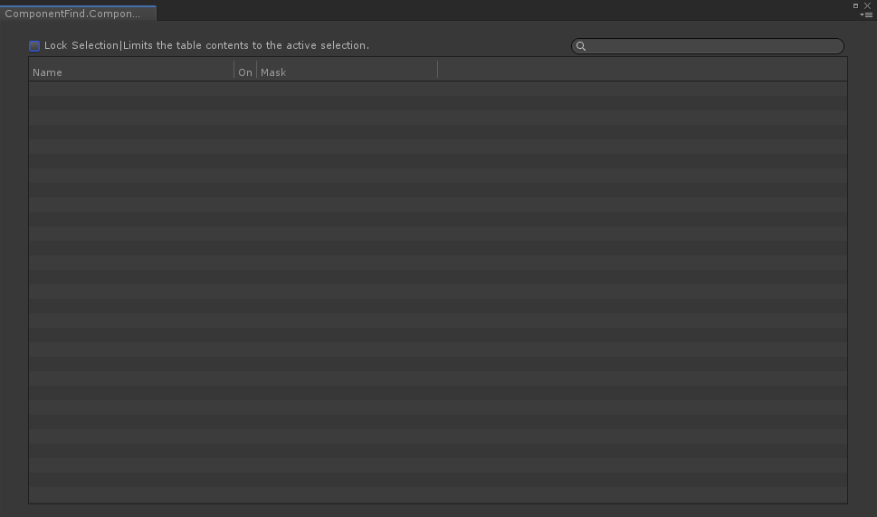

# UnityTable
A Unity SerializedPropertyTable from UnityEditor

从UnityEditor中剥离的Table显示模块，如图所示

  
有2种Table类可供使用
## SerializedPropertyTable
    用于可序列的数据对象集合的展示
    在本工程中，可以参考ComponentFindWindow.cs文件

## CommonTable
    用于非可序列数据对象集合的展示
    需要注意的是，CommonTable为抽象类，需要自行定义继承于CommonTable的子类
    在本工程中，请参考ExampleDataTableWnd.cs